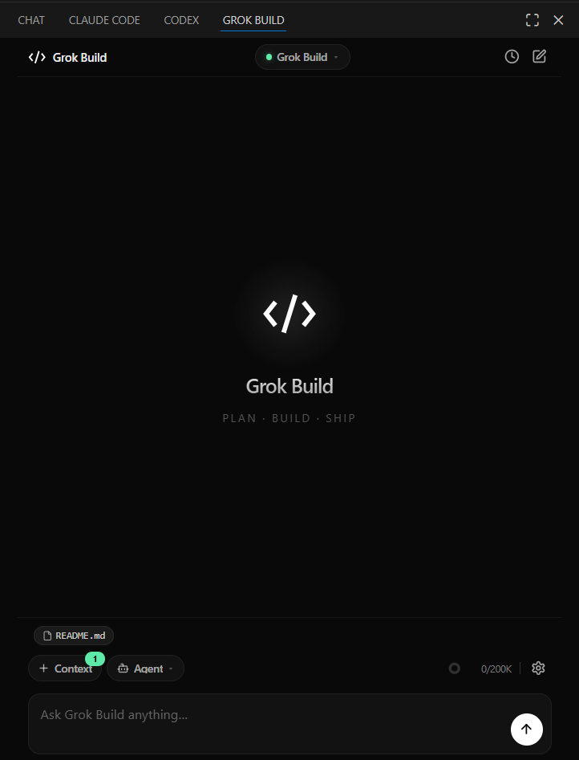
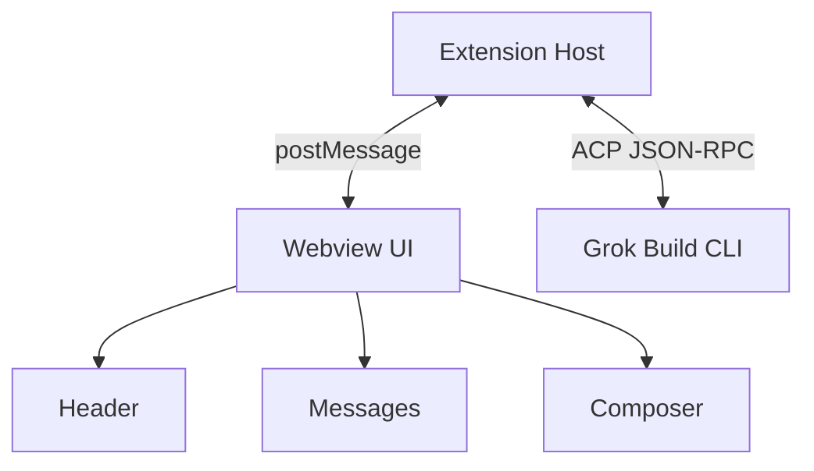
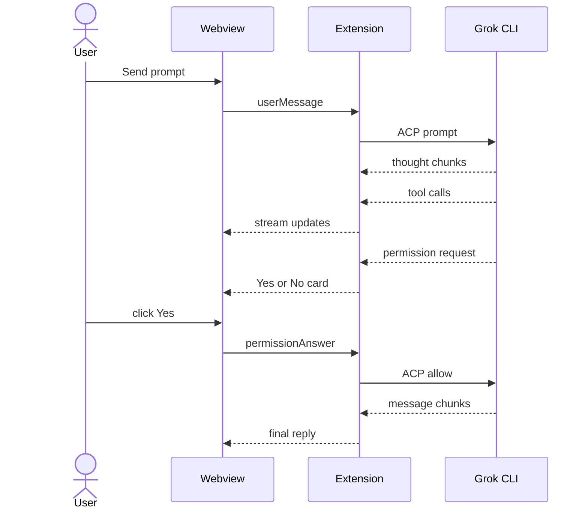

# Grok Build - XAI

<p align="center">
  
</p>

<p align="center">
  <strong>Plan · Build · Ship</strong><br/>
  <em>Professional AI agent for VS Code — powered by xAI Grok. Autonomous workflows, precise control, and production-grade results in your editor.</em>
</p>

<p align="center">
  
  
  
  
  
</p>

<p align="center">
  <strong>Owner & Maintainer:</strong> <a href="https://github.com/SahilRakhaiya05">Sahil Rakhaiya</a>
</p>

<p align="center">
  
</p>

---

**Grok Build - XAI** is a first-class VS Code extension that talks to `grok agent stdio` over the [Agent Client Protocol](https://agentclientprotocol.com). No browser shell, no terminal passthrough — a dedicated sidebar for coding with Grok: streaming chat, file context, tool approvals, session history, and a dark UI built for Plan · Build · Ship workflows.

---

## Why Grok Build - XAI?

| Terminal-only Grok | Grok Build - XAI |
|---|---|
| Plain text stream | Rich markdown, code blocks, diffs |
| No file context UI | Drag-drop, chips, image uploads |
| Manual model flags | **Header model picker** + effort controls |
| Session amnesia | History, resume, rename, delete |
| Silent waits | Live **Thinking** animation while Grok works |
| Raw permission prompts | Styled **Yes / No** edit approval cards |

---

## Interface layout

```text
+----------------------------------------------+
|  Grok Build       [Model v]         hist new |  HEADER
+----------------------------------------------+
|                                              |
|                 ( Grok mark )                |  WELCOME
|                 Grok Build                   |
|              Plan . Build . Ship             |
|                                              |
|  v Ran 2 commands                            |  TOOL TRACE
|    | Glob                                    |
|    | Glob                                    |
|  +------------------------------------------+|
|  | Edit index.html                          ||  PERMISSION
|  | path -- 1 to 47 lines                    ||
|  | open diff preview                        ||
|  +------------------------------------------+|
|  | Yes, allow all edits this session        ||
|  | Yes                                      ||
|  | No, tell Grok what to do differently     ||
|  +------------------------------------------+|
+----------------------------------------------+
| [Context] [Agent v]               0/200K set |  FOOTER
| +------------------------------------------+ |
| | Ask Grok Build anything...           [^] | |  COMPOSER
| +------------------------------------------+ |
+----------------------------------------------+
```

| Region | What it does |
|--------|----------------|
| **Header** | Brand, model picker (center), session history, new chat |
| **Welcome** | Centered Grok mark until your first message |
| **Tool trace** | Collapsible "Ran N commands" with blue-accent list |
| **Permission** | Edit approval with diff preview and Yes / No actions |
| **Footer** | Context button, Agent mode, context-usage donut, settings |
| **Composer** | Text input; mic when empty, send when typing |

---

## Architecture

<!-- markdownlint-disable MD033 -->

<!-- markdownlint-enable MD033 -->

| Component | Files / role |
|-----------|----------------|
| Extension Host | `sidebar.ts`, `acp.ts` — ACP bridge, session state |
| Webview UI | `chat.js`, `grok-theme.css` — chat rendering |
| Grok Build CLI | `grok agent stdio` — agent over JSON-RPC |
| Header | Model picker, session history, new chat |
| Messages | Thinking traces, tool groups, permission cards |
| Composer | Context, Agent mode, voice or send input |

### Message flow



---

## Requirements

| Requirement | Details |
|---|---|
| VS Code | **1.94+** |
| Grok CLI | Installed + authenticated |
| OS | Windows, macOS, Linux |

```powershell
# Install Grok CLI (Windows)
irm https://x.ai/cli/install.ps1 | iex
grok /login
```

---

## Install

### From source

```powershell
git clone https://github.com/SahilRakhaiya05/Grok-Build-GUI.git
cd Grok-Build-GUI
npm install
npm run package
code --install-extension grok-build-gui-1.0.0.vsix --force
```

Reload VS Code: `Ctrl+Shift+P` → **Developer: Reload Window**

### Uninstall

```powershell
pwsh scripts\uninstall.ps1
```

---

## Quick start

1. **Open** — click the Grok Build icon in the activity bar or secondary sidebar (`Ctrl+;`)
2. **Model** — pick your model from the **header dropdown** (center of top bar)
3. **Context** — tap **Context** or drag files onto the chat
4. **Mode** — choose **Agent**, **Plan**, or **YOLO** in the footer
5. **Send** — empty input shows **mic**; typing switches to **send** ▲
6. **Approve** — when Grok edits files, use the inline **Yes / No** card

---

## Features

### Chat and reasoning

- Streaming markdown with syntax highlighting
- Collapsible **Thinking** traces with duration labels
- Instant thinking animation after send (no blank wait)
- Optimistic user bubbles

### Agent tools and permissions

- Collapsible **Ran N commands** tool groups with blue accent list
- Inline **edit approval** cards with:
  - File path and line-range subtitle
  - **open diff preview →** link
  - **Yes, allow all edits during this session**
  - **Yes**
  - **No, and tell Grok what to do differently** (red)
- Shell, search, read, write, MCP tool cards
- VS Code diff preview on file changes

### Modes

| Mode | Behavior |
|---|---|
| **Agent** | Grok acts directly; asks approval for sensitive changes |
| **Plan** | Explores and proposes a plan; writes blocked until approved |
| **YOLO** | Auto-approves all permission requests |

### Context

- Add context menu: upload, active file, selection, browse
- Drag-and-drop files
- File chips with image highlighting
- `@` mentions from editor (`Alt+G`)

### Sessions

- Searchable history
- Resume, rename, delete
- New session restores centered welcome

### Voice (optional)

- Mic when composer is empty
- Live streaming transcription
- Hands-free send with `"grok send"` phrase

### Media

- Inline `/imagine` images
- `/imagine-video` playback
- Copy path + open in VS Code hover actions

---

## Keyboard shortcuts

| Shortcut | Action |
|---|---|
| `Ctrl+;` | Open Grok Build panel |
| `Alt+G` | Insert `@` file mention (in editor) |
| `Enter` | Send message (configurable) |

---

## Settings

Search **Grok** in VS Code Settings:

| Setting | Description |
|---|---|
| `grok.cliPath` | Custom path to `grok` binary |
| `grok.defaultModel` | Default model for new sessions |
| `grok.defaultEffort` | Reasoning depth (`low` → `xhigh`) |
| `grok.includeActiveFileByDefault` | Auto-attach active editor file |
| `grok.voiceApiKey` | xAI API key for voice input |
| `grok.autoOpenSecondarySidebar` | Open panel on startup (default: on) |

---

## Commands

| Command | Description |
|---|---|
| `Grok: Open Grok Build` | Focus the sidebar |
| `Grok: Pick Model` | Open header model picker |
| `Grok: Toggle Plan / Agent Mode` | Switch agent mode |
| `Grok: Upload Files` | Attach files as context |
| `Grok: Attach Active File` | Attach open editor file |
| `Grok: New Session` | Start fresh session |
| `Grok: Compact Conversation` | Send `/compact` |
| `Grok: Show Logs` | Open extension output |

---

## Development

```powershell
npm install
npm run compile    # TypeScript → out/
npm test           # 418 automated tests
npm run package    # Build .vsix
```

Press **F5** in VS Code to launch the Extension Development Host.

### Project structure

```
Grok-Build-GUI/
├── src/           # Extension host (sidebar, ACP bridge)
├── media/         # Webview (chat.js, grok-theme.css)
├── public/        # README assets (Preview.png)
├── resources/     # Icons and branding
├── docs/          # Architecture and docs
├── test/          # Vitest unit + DOM tests
└── scripts/       # Install, release, uninstall
```

---

## Troubleshooting

| Problem | Fix |
|---|---|
| Stuck on **Starting** | Reload window; check **View → Output → Grok** |
| CLI not found | Run installer or set `grok.cliPath` |
| Voice unavailable | Add `grok.voiceApiKey` from [console.x.ai](https://console.x.ai) |
| Model picker disabled | Wait for current turn to finish |
| Permission card missing diff | Click **open diff preview →** after Grok proposes an edit |

---

## License

MIT — Copyright (c) 2026 [Sahil Rakhaiya](https://github.com/SahilRakhaiya05)

Grok Build - XAI is an independent extension. It is not affiliated with, endorsed by, or maintained by xAI.
